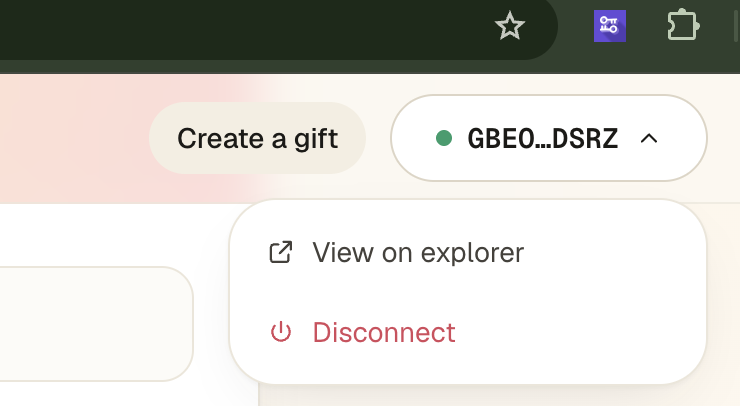
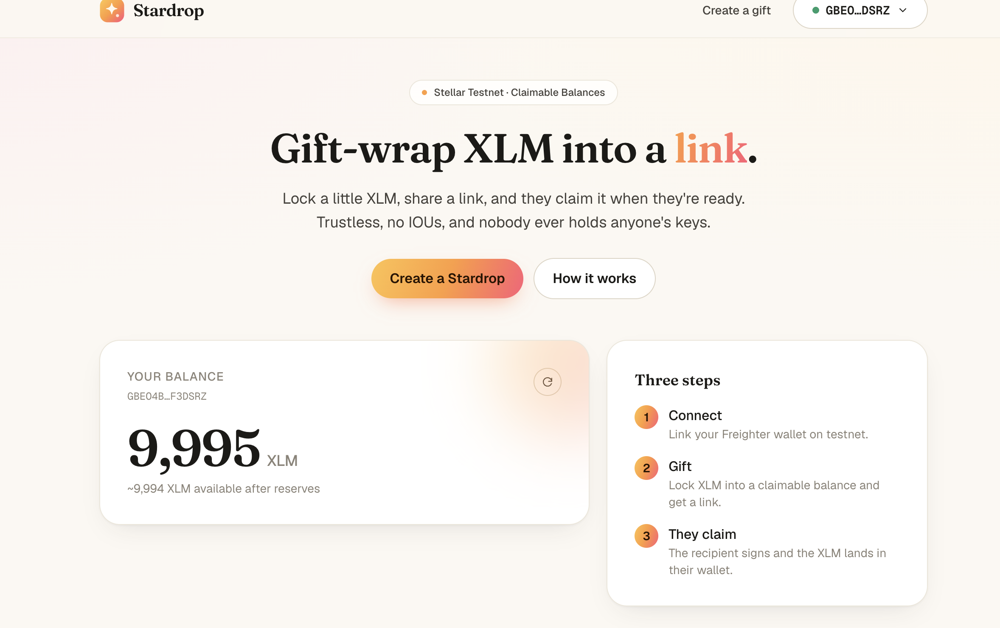
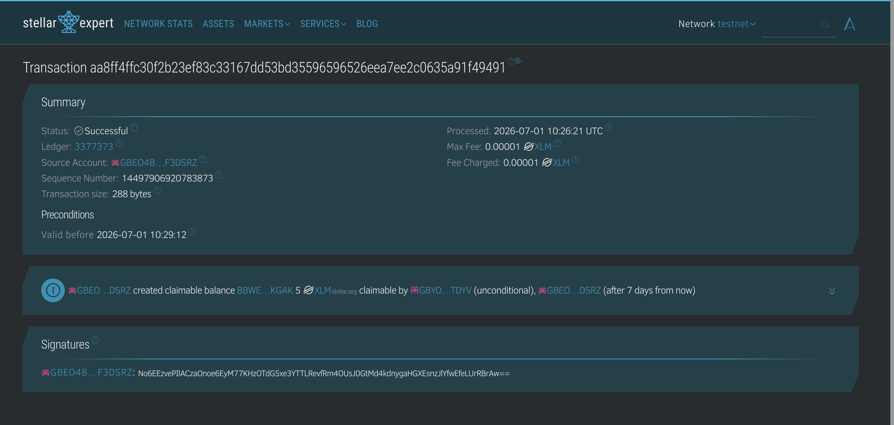
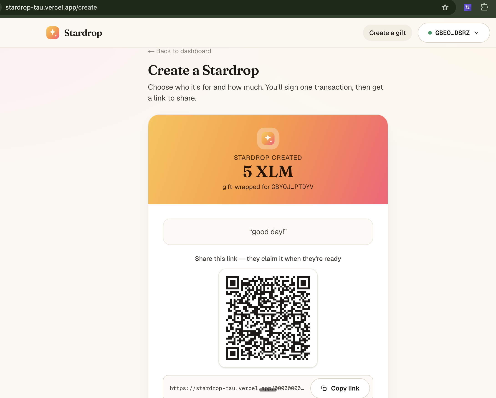

<div align="center">

# ⭐ Stardrop

### Gift-wrap XLM into a link. They claim it when they're ready.

A polished web dApp for gifting XLM as a shareable link on **Stellar Testnet** —
trustless, no "I'll pay you back," and nobody ever holds anyone's keys.

Built with Next.js + Stellar SDK

</div>

---

## What is Stardrop?

The sender locks an amount of XLM **on-chain**, and gets a shareable link (with a QR
code). The recipient opens the link, connects their own wallet, and claims it. Two
distinct signed transactions, both surfaced to the user with their transaction hashes
and explorer links. No custody, no IOUs.

### The differentiator: Claimable Balances

Most beginner Stellar projects do a plain payment. Stardrop is built on Stellar's
**Claimable Balances** — a native (no smart contract / Soroban needed) operation that
locks funds for a specific claimant to retrieve later:

| Action    | Operation                  | Who signs  | Result          |
| --------- | -------------------------- | ---------- | --------------- |
| **Send**  | `createClaimableBalance`   | Sender     | tx hash + a predicted balance ID → the share link |
| **Claim** | `claimClaimableBalance`    | Recipient  | tx hash → the XLM lands in their wallet |

The balance ID is predicted client-side with `tx.getClaimableBalanceId(0)` so the share
link is ready the instant the create transaction is signed.

### Why there's no smart contract (Classic vs Soroban)

A fair question: Stellar has smart contracts (Soroban, written in Rust), so where's the
contract here? There isn't one — **and that's by design.** Stellar gives you two distinct
ways to put logic on-chain:

|             | **Classic / native operations** (what Stardrop uses)   | **Soroban** (Stellar's smart-contract platform) |
| ----------- | ------------------------------------------------------ | ----------------------------------------------- |
| What it is  | Built-in transaction types baked into the protocol     | A programmable contract layer                   |
| Language    | None — you just submit operations                      | Rust → compiled to WASM, deployed on-chain      |
| Deploy step | Nothing to deploy                                      | You deploy a contract                           |

Stardrop's trustless-escrow behavior — funds locked, only the intended recipient can
claim, plus the optional 7-day reclaim — comes entirely from **native Claimable Balances
and their claimant predicates** (`predicateUnconditional`, and
`predicateNot(predicateBeforeRelativeTime("604800"))` for reclaim). The protocol enforces
all of it, so no Rust, no WASM, and no contract deploy are needed. Reaching for Soroban
here would add deploy complexity for behavior the base protocol already provides — which
is exactly why claimable balances keep this a clean "White Belt" build.

---

## Features

- **Connect & disconnect** any Stellar wallet (Freighter, xBull, Albedo, Lobstr) via
  Stellar Wallets Kit, on Testnet.
- **Live XLM balance** with reserve-aware "available" amount, and a one-click
  **Fund with Friendbot** button when an account is empty.
- **Create a gift** — recipient + amount + optional message → sign → submit → success
  card with the **tx hash (explorer link)**, the **shareable claim URL**, a **QR code**,
  and a copy button.
- **Claim a gift** — a gift-card claim page showing amount, sender, and message;
  **confetti** on success with the claim tx hash + explorer link.
- **Sent-gifts dashboard** with live **claimed / unclaimed** status and explorer links.
- **Reclaim after 7 days** (optional, stretch goal) — add yourself as a time-locked
  claimant so unclaimed gifts aren't lost.
- Clean error handling on **every** async path: wallet not installed / rejected
  signature, invalid address, insufficient balance (incl. reserves), unfunded account
  (offers Friendbot), already-claimed balance, and Horizon/network errors — each a clear
  toast, never a silent console error.
- Light, elegant "luminous gauge" design: cream canvas, a single warm gradient,
  skeleton loaders, mobile-first responsive.

---

## Required submission screenshots

> Drop the images into `docs/screenshots/` with these names and they'll render here.

| 1 · Wallet connected | 2 · Balance displayed |
| --- | --- |
|  |  |

| 3 · Successful testnet transaction | 4 · Transaction result shown |
| --- | --- |
|  |  |

---

## Tech stack

| Layer       | Choice                                              |
| ----------- | --------------------------------------------------- |
| Framework   | Next.js 16 (App Router) + TypeScript                |
| Styling     | Tailwind CSS v4                                      |
| Stellar SDK | `@stellar/stellar-sdk` (`Horizon.Server`)           |
| Wallet      | `@creit.tech/stellar-wallets-kit` (multi-wallet)    |
| Helpers     | `qrcode.react` (claim QR) · `sonner` (toasts)       |
| Network     | Stellar **Testnet** via `horizon-testnet.stellar.org` |
| Hosting     | Vercel                                              |

There is **no smart contract**. Claimable balances are a built-in Stellar operation —
this is firmly a "White Belt" project.

---

## Local setup

**Prerequisites:** Node.js 20.9+ and the [Freighter](https://www.freighter.app/) browser
extension.

```bash
# 1. Install dependencies
npm install

# 2. Run the dev server
npm run dev
# → http://localhost:3000
```

Then in your browser:

1. **Set Freighter to Testnet** (Freighter → Settings → Network → Test Net). Keep it on
   Testnet the whole time.
2. **Connect** your wallet on the dashboard.
3. If your balance is 0, click **Fund with Friendbot** — it airdrops 10,000 free test
   XLM (no real money, no application). You can also fund manually:
   `https://friendbot.stellar.org/?addr=YOUR_PUBLIC_KEY`
4. **Create a gift**, copy the link, open it in another browser/wallet, and **claim** it.

> **Testing the full loop:** fund **two** testnet accounts (a sender and a recipient).
> The recipient account must already exist on-chain (Friendbot-funded) before it can
> claim. Note that creating a claimable balance temporarily locks ~0.5 XLM of reserve per
> claimant on the sender's account until it's claimed (returned on claim/reclaim);
> the transaction fee is a negligible 0.00001 XLM.

No environment variables are required — all network config lives in `lib/stellar.ts`, and
the claim-link origin is read from `window.location` at runtime.

---

## Deploy to Vercel

**Live app:** https://stardrop-tau.vercel.app

```bash
# Push to a GitHub repo, then import it at vercel.com — zero config needed.
# Or with the Vercel CLI:
npx vercel
```

The frontend simply points at Testnet Horizon, so there's nothing to provision. This
repo is connected to Vercel's Git integration, so every push to `main` auto-deploys to
production.

---

## Proof it works (real testnet transactions)

The full create → claim cycle, verified end-to-end against live Testnet Horizon using the
exact `lib/stellar.ts` logic (5 XLM, A → B):

- **Create transaction:** [`355b4893…d5be684`](https://stellar.expert/explorer/testnet/tx/355b48936320d6a91060a79cccc961fcd76c5a1ddf42b8250913e6798d5be684)
- **Claim transaction:** [`80581511…ea74d2a`](https://stellar.expert/explorer/testnet/tx/805815113d1c34d51cc8b74c2e96bcdc1e293488020ac9187b84a6ff3ea74d2a)
- **Claimable balance:** [`00000000…b9aa5d`](https://stellar.expert/explorer/testnet/claimable-balance/0000000070856806164716245ca73ee4e42355a90741b122e22c47561ba433aeabb9aa5d) (now claimed)

The recipient's balance increased by 5 XLM and the claimable balance was deleted from
ledger state (Horizon returns 404 → claimed). Generate fresh links via Freighter for your
own submission screenshots.

---

## Project structure

```
app/
  layout.tsx          # WalletProvider + Toaster + brand fonts
  page.tsx            # Dashboard — balance, steps, sent gifts
  create/page.tsx     # Create a gift
  [balanceId]/page.tsx# Claim a gift (dynamic route)
components/
  WalletProvider.tsx  # wallet context (address, connect, disconnect, sign)
  WalletButton.tsx    BalanceCard.tsx    FriendbotButton.tsx
  GiftForm.tsx        ClaimCard.tsx      SentGifts.tsx
  TxResult.tsx        QrLink.tsx         CopyButton.tsx  Confetti.tsx
lib/
  stellar.ts          # network config + all on-chain helpers + error parser
  wallet.ts           # Stellar Wallets Kit singleton (browser-only, dynamic import)
  share.ts            # claim-link encoding   sentGifts.ts  useAccountSummary.ts
```

---

## Notes

- **Testnet resets** periodically (~quarterly); balances and history are wiped. Re-fund
  with Friendbot if that happens. Never use real value here.
- A claimable balance disappears from Horizon once claimed, so "sent gifts" are tracked
  locally (per sender address) and their status is derived by probing Horizon.

---

<div align="center">
Built on Stellar Testnet with Claimable Balances · No custody, no keys held, just a link.
</div>
